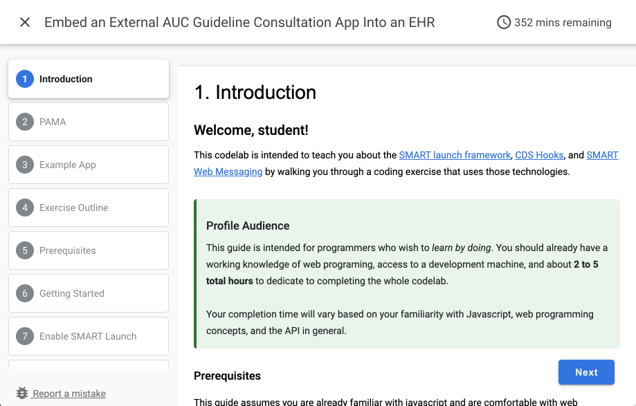
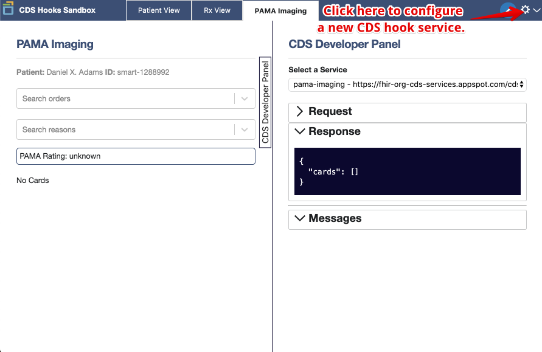
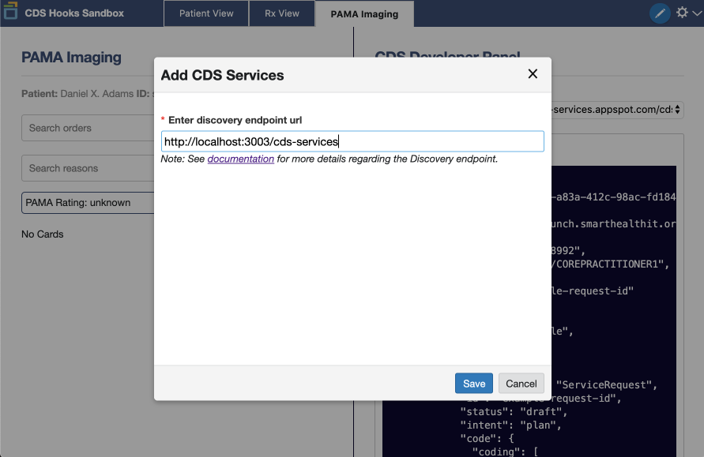
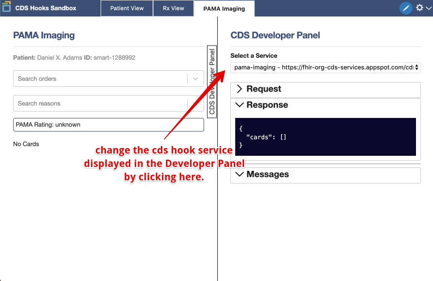
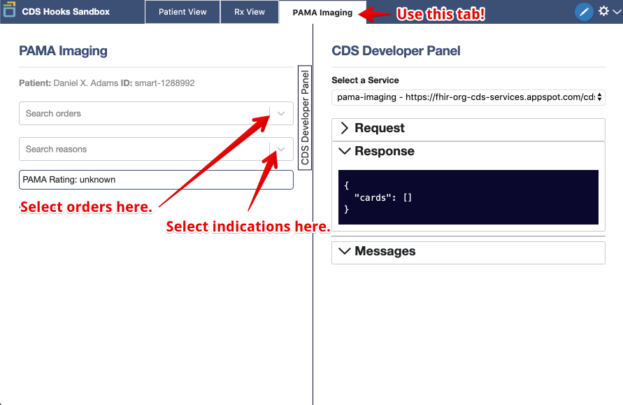
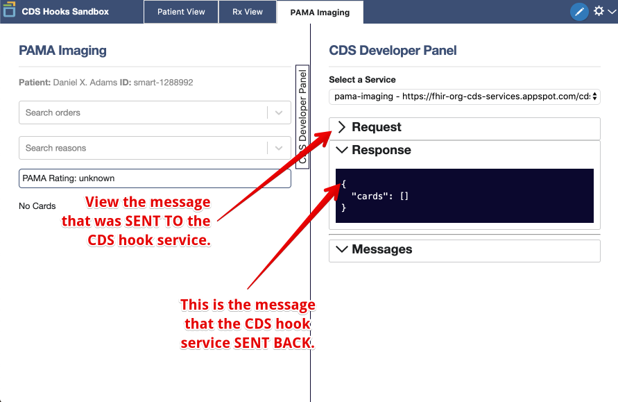
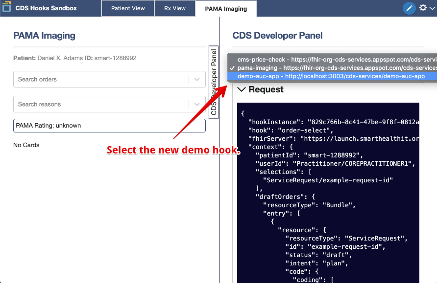

# Codelab
https://microsoft-healthcare-madison.github.io/demo-auc-app



This codelab is designed to walk you through a tutorial of implementing CDS Hooks, using the SMART Launch framework, bi-directional SMART Web Messaging, and to explore some of the motivations behind (and the practical implications of) mandatory AUC guideline consultation rules for 2020 and beyond.

# smart-auc-demo
A demonstration SMART app that serves AUC external guidance for PAMA.

Instructions
============

```sh
npm install
npm run all
```

CDS Hooks Sandbox
_________________


To launch the app via the CDS Hooks Sanbox, [click here](https://sandbox.cds-hooks.org) and configure the `demo-auc-app` service if it isn't already listed in the `PAMA Imaging` tab.









SMART App Launcher
__________________

To launch the app via SMART launch, [click here](http://launch.smarthealthit.org/?auth_error=&fhir_version_1=r4&fhir_version_2=r4&iss=&launch_ehr=1&launch_url=http%3A%2F%2Flocalhost%3A8899%2Flaunch.html&patient=&prov_skip_auth=1&provider=&pt_skip_auth=1&public_key=&sb=&sde=&sim_ehr=1&token_lifetime=15&user_pt=) and then click the green Launch App button.


Select a provider and a patient, then select an indication, and an order to 
determine whether it is within recommended guidelines.


V3 TODO
-------

- [x] Make a CDS Hook Service to *always* launch a SMART card for draft orders
  - [x] Refactor the AUC logic into a module, enabling use in the hook too.
  - [x] Write a new CDS Hook server to be run with npm
- [x] Complete the App
  - [x] Enable the EHR to close the form with a `ui.done` message
  - [x] Enable the form to read the draft order from the fhir client on load
  - [x] Enable writes to the form to update the draft order in the EHR

V2 TODO
-------

- [x] Make it work with SMART Launch
  - [x] Launch from http://launch.smarthealthit.org simulated EHR
- [x] Grab demographics from SMART context
  - [x] populating (name and DOB) or at least "age and gender" fields from v1
- [x] Everything else the same (except old login form was disabled)

V1 TODO
-------

- [x] Mock a simple UI on paper / in Visio
- [x] Create a static page form to serve as the starting point
  - [x] Fake sign-in
  - [x] Enter Demographics (age and gender)
  - [x] Select a condition
  - [x] Select an appropriate imaging procedure
