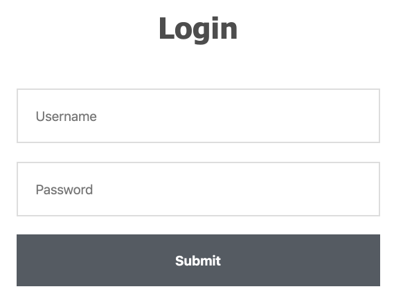
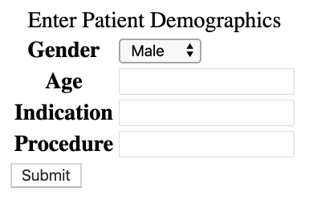

# smart-auc-demo
A demonstration SMART app that serves AUC external guidance for PAMA.

Instructions
------------

```sh
npm install
npm run demo
```

Visit http://localhost:3001/ to log in (use any username and password)



Select a patient age, gender, indication, and order to determine whether it
is within recommended guidelines.



V2 TODO
-------

- [ ] Make it work with SMART Launch
  - [ ] Launch from http://launch.smarthealthit.org simulated EHR
- [ ] Grab demographics from SMART context
  - [ ] populating (name and DOB) or at least "age and gender" fields from v1
- [ ] Everything else the same

V1 TODO
-------

- [x] Mock a simple UI on paper / in Visio
- [x] Create a static page form to serve as the starting point
  - [x] Fake sign-in
  - [x] Enter Demographics (age and gender)
  - [x] Select a condition
  - [x] Select an appropriate imaging procedure
