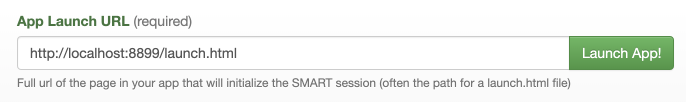
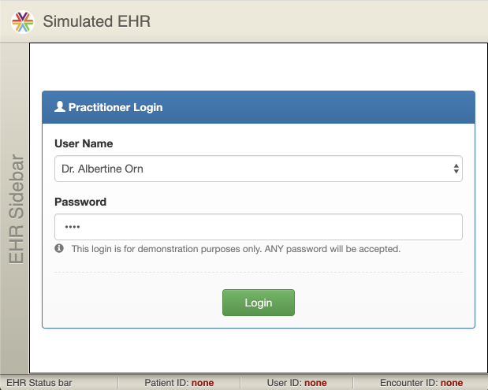
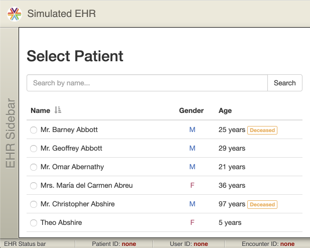
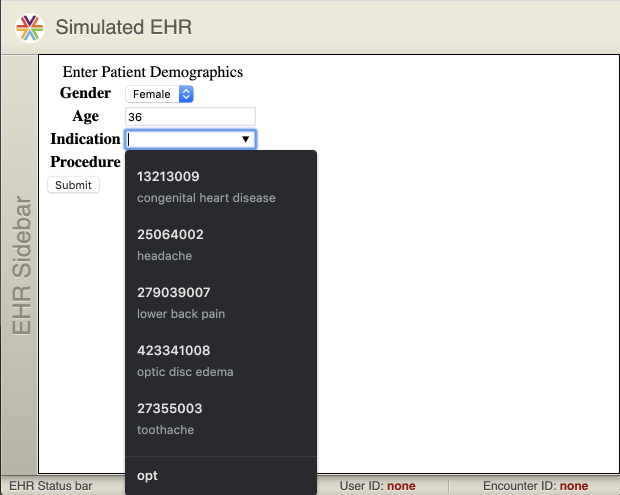
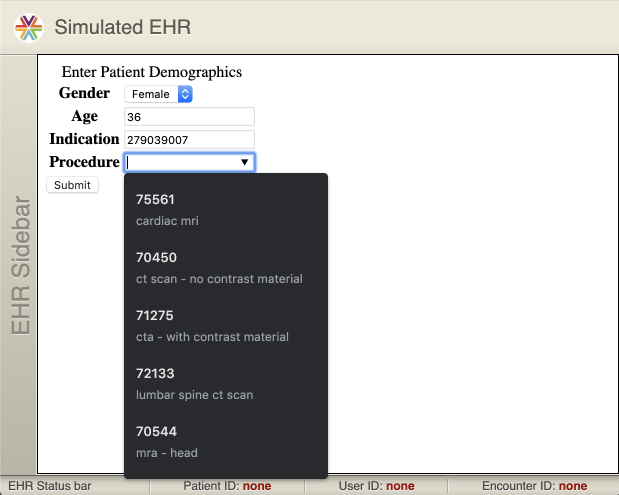
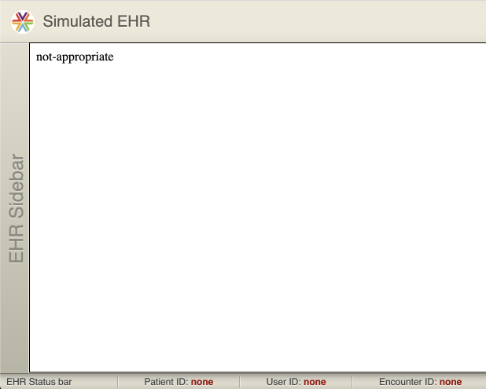

# smart-auc-demo
A demonstration SMART app that serves AUC external guidance for PAMA.

Instructions
------------

```sh
npm install
npm run launch &
npm run demo
```

To launch the app via SMART launch, [click here](http://launch.smarthealthit.org/?auth_error=&fhir_version_1=r4&fhir_version_2=r4&iss=&launch_ehr=1&launch_url=http%3A%2F%2Flocalhost%3A8899%2Flaunch.html&patient=&prov_skip_auth=1&provider=&pt_skip_auth=1&public_key=&sb=&sde=&sim_ehr=1&token_lifetime=15&user_pt=) and then click the green Launch App button.




Select a provider and a patient, then select an indication, and an order to 
determine whether it is within recommended guidelines.







V2 TODO
-------

- [x] Make it work with SMART Launch
  - [x] Launch from http://launch.smarthealthit.org simulated EHR
- [x] Grab demographics from SMART context
  - [x] populating (name and DOB) or at least "age and gender" fields from v1
- [x] Everything else the same (except old login form was disabled)

V1 TODO
-------

- [x] Mock a simple UI on paper / in Visio
- [x] Create a static page form to serve as the starting point
  - [x] Fake sign-in
  - [x] Enter Demographics (age and gender)
  - [x] Select a condition
  - [x] Select an appropriate imaging procedure
