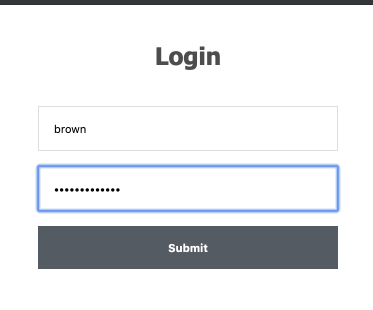

summary: Demo EHR Integrated AUC Guideline Consultation App
id: demo-auc-app
categories: cds-hoooks smart smart-web-messaging
environments: Web
status: Draft
feedback link: https://github.com/microsoft-healthcare-madison/demo-auc-app/issues
tags: cds-hoooks smart smart-web-messaging smart-launch pama auc qcdsm ple
authors: Carl Anderson

<!--- DEV NOTE
# Run this in a terminal to automatically re-extract the codelab when the source
# markdown is changed.

cd ~/code/googlecodelabs/site/
gulp serve --codelabs-dir=codelabs
CODELAB=../../../madison-healthcare-madison/demo-auc-app/codelab.md

while kqwait $CODELAB && claat export $_; do continue; done

--->

# Embed an External AUC Guideline Consultation App Into an EHR

## Introduction
Duration: 10

### Welcome, student!

This codelab is intended to teach you about the [SMART launch framework](http://www.hl7.org/fhir/smart-app-launch/), [CDS Hooks](https://cds-hooks.org/), and [SMART Web Messaging](https://github.com/smart-on-fhir/smart-web-messaging) by walking you through a coding exercise that uses those technologies.

#### Profile Audience

This guide is intended for programmers who wish to *learn by doing*.  You should already have a working knowledge of web programing, access to a development machine, and about 2 to 4 total hours to dedicate to completing the whole codelab.

#### Prerequisites

This guide assumes you are already familiar with javascript and are comfortable with web programming concepts.  It also helps to know the basics of `git`, but there will be example commands throughout for convenience.  The provided initial codebase uses `javascript`, `node`, `npn`, and `express` - so some prior experience with those tools will be helpful, but not required.

As always, you are free to re-write entire portions of the code in whatever framework you like (but please feel free to share your work with us)!

#### Major Milestones

You will start with an already-implemented form-entry app that evaluates the appropriateness of a potential advanced imaging order and displays a rating of either `appropriate`, `not-appropriate`, or `no-guidelines-apply`.

- v1: Make the app SMART-launch capable, enabling an EHR to launch it.
- v2: Create a CDS hook service to evaluate a *draft* order in an EHR, and show a link to the SMART app.
- v3: Enable the SMART app to update the draft order inside the EHR.

## PAMA
Duration: 20

### PAMA - Protecting Access to Medicare Act of 2014

<dt>Negative</dt>
<dd>
***"If we in the United States could lower the prices and per-capita volumes of our CT scans, MRIs, and just the top 25 high-volume-high-price surgical procedures to those of the Netherlands, for example, we would see savings of about $425 per capita, or a total of $137 billion."***
<p>
<p>
**[Ezekiel Emanuel](https://en.wikipedia.org/wiki/Ezekiel_Emanuel), on an [article published in JAMA, March 2018](https://jamanetwork.com/journals/jama/article-abstract/2674671)**
</dd>

#### Skip Ahead
This section has *lots* of background which explains *why* the [PAMA](https://www.cms.gov/Medicare/Medicare-Fee-for-Service-Payment/ClinicalLabFeeSched/PAMA-Regulations) imaging use case was chosen for this exercise.  If you aren't interested in PAMA, and are here purely to learn the technology, you can skip ahead to the next section.  However, it might help to take at least *a few* minutes to skim this material, just to get the gist of what problem is being solved.

#### **Warp** Ahead

If you already have a good grasp of the SMART launch process, and you would like to do a lot more than *skip* ahead, you can **warp** ahead and begin the process at CDS hook implementation by checking out the code at `v2.0` in the repo and advancing to the section called **Write a CDS hook** in this codelab.

There's another git tag, `v3.0`, for the **final** solution.  Check out this version of the code if you just want to play with a working copy of the app.  However, if you're here to learn, it is recommended that you find time to do the full codelab.

### PAMA Imaging
New PAMA imaging requirements are taking effect, starting on January 1st, 2020.  The American College of Radiology has put out some very helpful media to explain why this is important.

- <https://www.acr.org/-/media/ACR/Files/Clinical-Resources/Clinical-Decision-Support/RSCAN-PAMA_flyer.pdf>
- <https://www.acr.org/Clinical-Resources/Clinical-Decision-Support>

#### Timeline

| Year | What's Planned |
|------|----------------------------------------------------------------|
| 2020 | Starting in 2020, providers in the US who order diagnostic advanced imaging (CT, MRI, nuclear medicine, and PET scans) will need to provide *evidence* that they have consulted *best practice guidelines* for appropriate use of that technology *while they are still at the point of order entry*. |
| 2021 | Failure to submit a claim for imaging that has this evidence, starting in 2021, may *prevent* reimbursement (for Medicare part B claims) for furnishing providers (who are typically radiologists). |
| 2022 | Ordering providers who have a *consistently* poor history of ordering "low value" diagnosic imaging may then be subject to mandatory prior authorization before placing image orders for Medicare patients starting in 2022.  Some of those rules are TBD, depending on how the first two years go, though. |

#### Apropriate Use Criteria (AUC)
In short, for software to determine whether an imaging technique is *apropriate* or not for a given diagnosis, several groups of specialists have been developing *apropriate use criteria* and publishing that criteria for the industry to adopt into the EHR workflow.  These AUC are regularly improved, updated, and re-published.

#### Provider Led Entities (PLE)
The groups of experts and specialists who decide what is and isn't appropriate are called *Provider Led Entities*.  They develop the AUC out in the open and publish it reqularly for consumption by software vendors who provide CDS.

#### Qualified CDS Mechanisms (QCDSM)
The software providers who use this criteria, the QCDSM vendors, must provide access to best practice guidelines for a wide spectrum of medical care areas.  For PAMA imaging, we are interested in the radiology imaging AUC and we have prepared a simple example of QCDSM guideline consultation software.  However, a QCDSM must use more than one published set of AUC in their software, and have a method of updating their AUC periodically.  As such, the software can be quite complex, and is often implemented as a stand-alone web service.

### Frequently Asked Questions

#### Why are *CDS Hooks* important for PAMA?
<dt>Positive</dt>
<dd>To satisfy a radiologist's claim to CMS, the original order must include evidence that guidelines were consulted at the point of order entry (by the *ordering provider*).  This means that, while the ordering provider is still using the EHR, they must also be consulting a guideline app.  By using *CDS Hooks*, the EHR can provide a link to the guideline app as soon as it's relevant (like when selecting an order for advanced imaging, before signing the order).
</dd>

#### Why is *SMART Web Messaging* important for PAMA?
<dt>Positive</dt>
<dd>Because the logic to determine *when* a service is or isn't appropriate can be very complex, this logic is often implemented in stand-alone web-based applications.  To enable those applications to **update** the currently *draft* order, we need SMART Web Messaging.  With SMART Web Messaging, we can easily and securely send data and actions *back* into the EHR.</dd>

## Exercise Outline
Duration: 5

You are provided with a very simple, but working, guideline consultation app.  In PAMA parlance, this would be software from a Qualified CDS Mechanism, or a QCDSM.


### SMART Launch

You will add SMART launch capabilities to the app, allowing it to be launched by the EHR and to receive EHR data directly through the SMART launch client.

**TODO**: if possible, host the working v2 code on glitch and embed a link to it here.

### CDS Hooks

Once the app is capable of a SMART launch, you will write a CDS Hook service to alert ordering providers when they have made an order selection that is outside of guidelines.  The alert will give them a helpful link to click on, which will launch the app *within the EHR*.  The app will read context from the EHR and use that to pre-populate the appropriate fields in its form, saving the clinician time and mental effort.

**TODO**: insert some images of the cards

### SMART Web Messaging

Finally, a new button will be added in the app that will be able to update the draft order items with the current selection.  Upon update, evidence of guideline consultation will be attached to the order, before closing the app, returning the user to the order entry screen in the EHR.

**TODO**: insert an image of the embedded app.

### Frequently Asked Questions

#### Which EHRs currently support the technologies required to enable these services?

Positive
: Currently, Epic and T-System have implemented the required CDS hooks to enable this.  Cerner has committed to doing this, though, and it's not a matter of if, but of when.

## Prerequisites
Duration: 5

You must have a development machine with the following:

| Tool  | Download | Purpose |
|-------|----------|---------|
| `git` | [Download](https://git-scm.com/downloads) | Needed to check out the initial codebase. |
| `nvm` | [Download](https://github.com/nvm-sh/nvm) | RECOMMENDED to manage different installed versions of `node`. |
| `nvm-windows` | [Download](https://github.com/coreybutler/nvm-windows/releases) | WINDOWS version of `nvm`. |
| `npm` | [Download](https://nodejs.org/en/download/) | Needed to install the server dependencies and run it locally. |

Positive
: This guide was developed using `node v11.0.0`, but any version higher than that should also work.

### Links
- <https://www.sitepoint.com/quick-tip-multiple-versions-node-nvm/>

### Frequently Asked Questions
- <https://stackoverflow.com/questions/16904658/node-version-manager-install-nvm-command-not-found>
- <https://stackoverflow.com/questions/9755841/how-can-i-change-the-version-of-npm-using-nvm>
- <https://stackoverflow.com/questions/34810526/how-to-properly-upgrade-node-using-nvm>


## Getting Started
Duration: 15

### Code Repository

The companion source code for this codelab is currently at:
<https://github.com/microsoft-healthcare-madison/demo-auc-app>

### Clone v1.0

To begin this codelab, begin by cloning the repository *at* the initial version, which is `v1.0`.

```sh
mkdir ~/codelab
cd ~/codelab
git clone --branch v1.0 git@github.com:microsoft-healthcare-madison/demo-auc-app.git
cd demo-auc-app
npm install
```

The demo app is now ready to be started using this command:

```sh
npm run demo
```

To view the app, visit this URL: <http://localhost:3001>

#### Login
You can use any non-empty username and password to log in to the app.



### Exercises
To get you familiar with the app and how it works, please launch the app and use it to rate the following combinations of demographics.

| Age | Gender | Indication               | Procedure                          |
|-----|--------|--------------------------|------------------------------------|
| 4   | male   | lower back pain          | lumbar spine CT                    |
| 98  | female | congenital heart disease | cardiac mri                        |
| 29  | female | headache                 | ct scan without contrast materials |

Be sure to *also* try any of the above tests, but with a missing field.  The app should require you to enter a value for each field (without doing any *additional* sanity checking, though).

### Frequently Asked Questions

#### I see this when trying to run the demo: `npm ERR! code ENOENT`

Negative
: Be sure you run `npm install` inside the `demo-auc-app` directory that you cloned from git.  After that completes, *then* run `npm run demo` and visit <http://localhost:3001>.

#### This site can't be reached.

Negative
: Be sure you ran `npm run demo` to start the local server before visiting the app at <http://localhost:3001>.

#### This site can’t provide a secure connection.

Negative
: You may have typed `https` instead of `http` in the URL.  You must use `http` for this.

## Enable SMART launch
Duration: 60

With the [SMART App Launch Framework](https://www.hl7.org/fhir/smart-app-launch/), the app will be able to securely read data from the EHR using the credentials of the clinician (through OAuth2 openid connect).  The provider will not need to remember a separate username and password to use the app anymore, and the app will be able to pre-load form fields using the available context in the EHR.

This will reduce user errors, save the user time, and spare them some frustrations.

### SMART Launch Documentation

There is a very handy javascript library to enable easy configuration of SMART launches from the app.
<http://docs.smarthealthit.org/client-js/>

#### EXERCISE 1
Positive
: Consult the link above, and create a `launch.html` endpoint.

Confused?  Part of the goal of this codelab is to get you familiar with using the documentation, so there will be minimal hand-holding throughout.

Here are a couple of hints, in case this seems like a vague request.  

- You may need to use the `npm` command to install the library.
- Once installed, you will want to create an endpoint 'page' for use in a browser using the 'As Library' approach, rather than the 'As Module' approach.

TODO: reveal a solution `launch.html` endpoint and confirm that student solution is correct.
- Are the scopes correct?
- What is the value of the client_id (AND WHAT SHOULD IT BE???)

More information about scopes.
<http://www.hl7.org/fhir/smart-app-launch/scopes-and-launch-context/index.html>

### The SMART App Launcher

To test the new launch endpoint, we can use a free, open source tool called the SMART App Launcher.
<http://launch.smarthealthit.org/>

EXERCISE: Visit the site and enter the path to your `launch.html` endpoint.  Click the green Launch App button to test.

#### Troubleshooting & Caveats

PROBLEM: I only see a white screen.

ANSWER: You may have entered an `https`, rather than an `http`, endpoint url.  Try changing it to `http`.


- EXERCISE: Add SMART launch url to the app
- TODO: Outline the requirements for pre-populating the age and gender in form.
- TODO: Link to the SMART launch documentation.
- EXERCISE: Complete the SMART launch
- EXERCISE: Extract the patient and provider from the client
- TODO: Provide the code to apply the data to the form
- TEST: Ask user to launch from SMART App Launcher with a default patient, default provider, both, neither, etc.
- EXERCISE: Remove legacy login code.

### Frequently Asked Questions

## Write a CDS hook

Duration: 90


Outline

- TODO: Show the design goals.
- TODO: Link to the CDS hooks documentation.
- TODO: Explain the discovery endpoint.
- EXERCISE: Ask user to write a new discovery endpoint.
- TODO: Introduce the CDS Hooks Sandbox
- EXERCISE: Ask user to add their service in the sandbox.
- TODO: Link to the Cards documentation
- TODO: Provide the refactored auc.js code.
- EXERCIES: Ask user to insert it, removing old code.
- TODO: Provide a simple template card
- EXERCISE: Add severity & custom icon to the card.
- TEST: Ask user to trigger the app by selecting certain criteria in the sandbox.

### Frequently Asked Questions

## SMART Web Messaging

Duration: 60

Outline

- TODO: introduce the design goals (show pictures of the wanted UI).
- TODO: link to the documentation.
<https://github.com/smart-on-fhir/smart-web-messaging>

- EXERCISE: Serialize the draft order, saving into the card.link.appContext
- EXERCISE: Ask user to deserialize the draft order in the index.html client context
- TODO: Provide the code to update the html using the client context
- TODO: Link to the SMART Web Messaging docs
- EXERCISE: Ask user to implement the closeApp function using window.postMessage
- TODO: provide the code to apply auc logic to the form (the Evaluate button)
- EXERCISE: Ask user to implement the updateApp function
- TEST: confirm that updates in the launched app update the cds hooks sandbox

### Frequently Asked Questions

## Bonus Exercies

These are optional exercises that you are welcome to take on, if you chose.

### `auc.js`

Update the logic to include more criteria.

### App Client Refresh

When the app gets a token from the SMART launch API, that token eventually will timeout.  The UI could give the user an option to request a refresh before it expires, or at least indicate in the UI when the token has expired (with a message like "EHR token has expired - please reload").

### Frequently Asked Questions

## Codelab Examples

### What You'll Learn
- How to trigger the special syntax of a codelab, as processed by the `claat` tool.
- What each special feature *looks like*.
  - What You'll Learn
  - Tables
  - Infoboxes
  - Surveys
  - Download Button
  - Embedded iframes
  - Frequently Asked Questions
  - What We've Covered

When you use the magic H3 heading `### What You'll Learn` - the following unordered list will be rendered using green checkboxes instead of the default bullet points.

#### `codelab markdown`
```html
### What You'll Learn
- hi
- there
```

### Tables

Your codelab can use very simple markdown (or HTML) tables.

#### HTML-based
<table>
  <tr><td>one</td><td>two</td><td>nine</td><td>thirteen</td></tr>
  <tr><td>three</td><td>four</td><td>ten</td></tr>
  <tr><td>five</td><td>six</td><td>eleven</td></tr>
  <tr><td>seven</td><td>eight</td><td>twelve</td></tr>
</table>

#### Markdown-based
| This  | Is    | A      | Table    |
|-------|-------|--------|----------|
| one   | two   | nine   | thirteen |
| three | four  | ten    |          |
| five  | six   | eleven |          |
| seven | eight | twelve |          |

#### `codelab markdown`

```html

#### HTML-based
<table>
  <tr><td>one</td><td>two</td><td>nine</td><td>thirteen</td></tr>
  <tr><td>three</td><td>four</td><td>ten</td></tr>
  <tr><td>five</td><td>six</td><td>eleven</td></tr>
  <tr><td>seven</td><td>eight</td><td>twelve</td></tr>
</table>

#### Markdown-based
|-------|-------|--------|----------|
| one   | two   | nine   | thirteen |
| three | four  | ten    |          |
| five  | six   | eleven |          |
| seven | eight | twelve |          |

```

### Infoboxes

You can highlight a section of code as either a positive or a negative infobox.

<dt>positive</dt>
<p>This is a positive infobox.</p>

<dt>negative</dt>
<p>This is a negative infobox.</p>

#### `codelab markdown`

```html
<dt>positive</dt>
<p>This is a positive infobox.</p>

<dt>negative</dt>
<p>This is a negative infobox.</p>
```

<!--- This is an example codelab survey  --->
### Surveys

You can include a survey in the codelab which will create Google Analytics variables, which will collect survey response totals.

<dl><dt style="background-color:#cfe2f3;">Survey</dt>
<dd>
  <li>Example item 1</li>
  <li>Example item 2</li>
</dd></dl>

#### `codelab markdown`
```html
<dl><dt style="background-color:#cfe2f3;">Survey</dt>
<dd>
  <li>Example item 1</li>
  <li>Example item 2</li>
</dd></dl>
```

#### IMPORTANT!
<dt>Negative</dt>
<p>Unfortunately, the background color value (`#cfe2f3`) is a *magic* attribute value.  Without this *exact* color value, the Survey object will not work as intended.</p>

### Download buttons

You can create a special button to Download something (like a tagged github repo).
[Download v3.0](https://github.com/microsoft-healthcare-madison/demo-auc-app/archive/v3.0.zip)

Negative
: This currently doesn't work with the `claat` tool!  Instead the 'button' is shown as a download link.

### Embedded iframes
You can embed an iframe in a codelab by setting the `alt` attribute of an `img` element.

#### Example: embedded `https://glitch.com/~howoldisit`


#### `codelab markdown`
```html

```

### Frequently Asked Questions
- <https://stackoverflow.com/questions/43001894/google-codelab-mistake>
- <https://developer.android.com/courses/fundamentals-training/toc-v2>

When linking to stack-overflow (and a few other google-specific URLs) - the link icon is automatically inserted into the link.

#### `codelab markdown`

```html
### Frequently Asked Questions
- <https://stackoverflow.com/questions/43001894/google-codelab-mistake>
- <https://developer.android.com/courses/fundamentals-training/toc-v2>
```

### What We've Covered
- How to trigger the special syntax of a codelab, as processed by the `claat` tool.
- What each special feature *looks like*.
  - What You'll Learn
  - Tables
  - Infoboxes
  - Surveys
  - Download Button
  - Embedded iframes
  - Frequently Asked Questions
  - What We've Covered

When you use the magic H3 heading `### What We've Covered` - the following unordered list will be rendered using green checkboxes instead of the default bullet points.

#### `codelab markdown`
```html
### What We've Covered
- good
- bye
```
