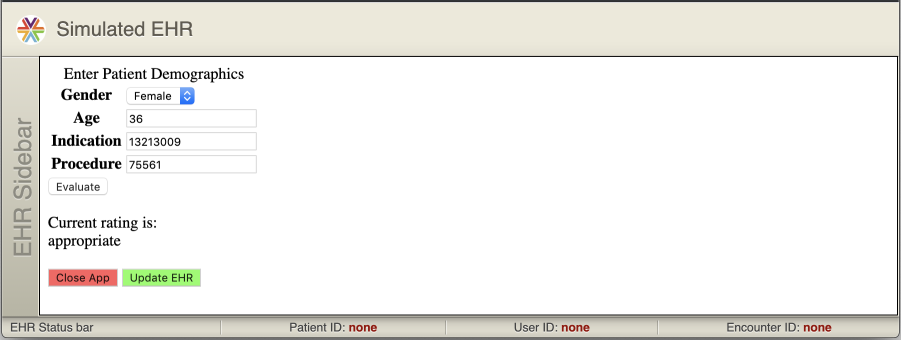
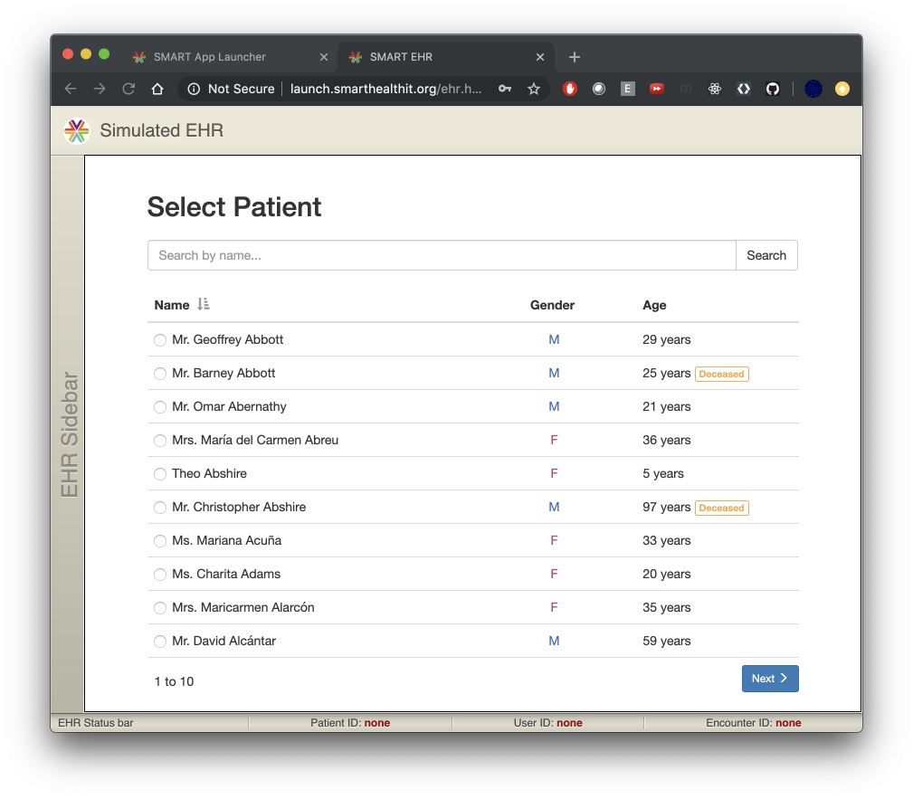
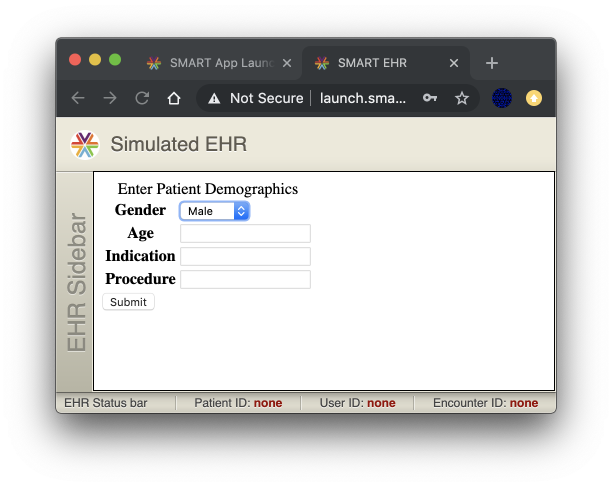
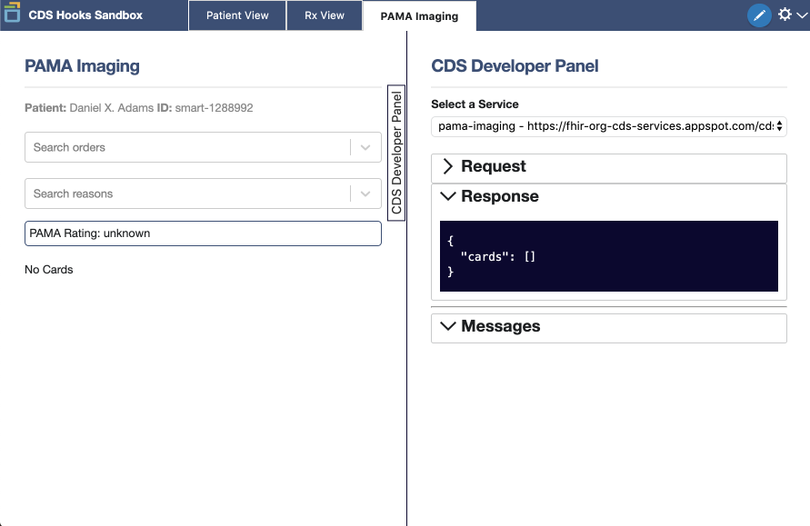

summary: Demo EHR Integrated AUC Guideline Consultation App
id: docs
categories: cds-hoooks smart smart-web-messaging
environments: Web
status: Draft
feedback link: https://github.com/microsoft-healthcare-madison/demo-auc-app/issues
tags: cds-hoooks smart smart-web-messaging smart-launch pama auc qcdsm ple
authors: Carl Anderson

<!--- DEV NOTE
# Run this in a terminal to automatically re-extract the codelab when the source
# markdown is changed.

cd ~/code/googlecodelabs/site/
gulp serve --codelabs-dir=codelabs
CODELAB=../../../madison-healthcare-madison/demo-auc-app/codelab.md

while kqwait $CODELAB && claat export $_; do continue; done


# To PRINT this codelab, refer to Marc's instructions here:
# https://groups.google.com/forum/#!topic/codelab-authors/pnnY50o82Qw

# Be sure to update the URL variable to 'http://localhost:8000/codelabs/'
--->

# Embed an External AUC Guideline Consultation App Into an EHR

## Introduction
Duration: 10

### Welcome, student!

This codelab is intended to teach you about the [SMART launch framework](http://www.hl7.org/fhir/smart-app-launch/), [CDS Hooks](https://cds-hooks.org/), and [SMART Web Messaging](https://github.com/smart-on-fhir/smart-web-messaging) by walking you through a coding exercise that uses those technologies.

<dt>positive</dt>
<div>
#### Profile Audience
<br>This guide is intended for programmers who wish to *learn by doing*.  You should already have a working knowledge of web programing, access to a development machine, and about **2 to 5 total hours** to dedicate to completing the whole codelab.
<br>Your completion time will vary based on your familiarity with Javascript, web programming concepts, and the API in general.
</div>

#### Prerequisites

This guide assumes you are already familiar with javascript and are comfortable with web programming concepts.  It also helps to know the basics of `git`, but there will be example commands throughout for convenience.  The provided initial codebase uses `javascript`, `node`, `nvm`, `npm`, and `express` - so some prior experience with those tools will be helpful, but not required.  JavaScript in the browser and in Node.js, and the express Web framework for Node.js

#### Contributing

As always, you are free to re-write entire portions of the code in whatever framework you like (and please feel free to share your work with us)!

The codelab has a wiki which should help you decide how to best contribute:
<https://github.com/microsoft-healthcare-madison/demo-auc-app/wiki>

Also, take notice of the [Report a mistake](https://github.com/microsoft-healthcare-madison/demo-auc-app/issues) link that appears in the lower left corner of each page!

#### Major Milestones

You will start with an already-implemented form-entry app that evaluates the appropriateness of a potential advanced imaging order and displays a rating of either `appropriate`, `not-appropriate`, or `no-guidelines-apply`.

- v1: Make the app SMART-launch capable, enabling an EHR to launch it.
- v2: Create a CDS Hooks service to evaluate a *draft* order in an EHR, and show a link to the SMART app.
- v3: Enable the SMART app to update the draft order inside the EHR.

<dt>negative</dt>
<div>
#### Note for Students
If you already have a good grasp of PAMA, the SMART launch process, and CDS Hooks, you can **skip** ahead and begin the process *after* the CDS Hooks implementation by checking out the code at `v2.0` in the repo and advancing to the section called **SMART Web Messaging** in this codelab.

There's another git tag, `v3.0`, for the **final** solution.  Check out this version of the code if you just want to play with a working copy of the app.  However, if you're here to learn, it is recommended that you find time to do the full codelab.
</div>
</div>

## PAMA
Duration: 20

### PAMA - Protecting Access to Medicare Act of 2014

<dt>Positive</dt>
<dd>
***"If we in the United States could lower the prices and per-capita volumes of our CT scans, MRIs, and just the top 25 high-volume-high-price surgical procedures to those of the Netherlands, for example, we would see savings of about $425 per capita, or a total of $137 billion."***
<p>
<p>
**[Ezekiel Emanuel](https://en.wikipedia.org/wiki/Ezekiel_Emanuel), on an [article published in JAMA, March 2018](https://jamanetwork.com/journals/jama/article-abstract/2674671)**
</dd>

### PAMA Imaging
New PAMA imaging requirements are taking effect, starting on January 1st, 2020.  The American College of Radiology has put out some very helpful media to explain why this is important.

- <https://www.acr.org/-/media/ACR/Files/Clinical-Resources/Clinical-Decision-Support/RSCAN-PAMA_flyer.pdf>
- <https://www.acr.org/Clinical-Resources/Clinical-Decision-Support>

#### Timeline

| Year | What's Planned |
|------|----------------------------------------------------------------|
| 2020 | Starting in 2020, providers in the US who order diagnostic advanced imaging (CT, MRI, nuclear medicine, and PET scans) will need to provide *evidence* that they have consulted *best practice guidelines* for appropriate use of that technology *while they are still at the point of order entry*. |
| 2021 | Failure to submit a claim for imaging that has this evidence, starting in 2021, may *prevent* reimbursement (for Medicare part B claims) for furnishing providers (who are typically radiologists). |
| 2022 | Ordering providers who have a *consistently* poor history of ordering "low value" diagnosic imaging may then be subject to mandatory prior authorization before placing image orders for Medicare patients starting in 2022.  Some of those rules are TBD, depending on how the first two years go, though. |

#### Apropriate Use Criteria (AUC)
In short, for software to determine whether an imaging technique is *apropriate* or not for a given diagnosis, several groups of specialists have been developing *apropriate use criteria* and publishing that criteria for the industry to adopt into the EHR workflow.  These AUC are regularly improved, updated, and re-published.

#### Provider Led Entities (PLE)
The groups of experts and specialists who decide what is and isn't appropriate are called *Provider Led Entities*.  They develop the AUC out in the open and publish it reqularly for consumption by software vendors who provide CDS.

#### Qualified CDS Mechanisms (QCDSM)
The software providers who use this criteria, the QCDSM vendors, must provide access to best practice guidelines for a wide spectrum of medical care areas.  For PAMA imaging, we are interested in the radiology imaging AUC and we have prepared a simple example of QCDSM guideline consultation software.  However, a QCDSM must be able to use more than one published set of AUC in their software, and have a method of updating their AUC periodically (See pages 4 and 5 [here](https://www.cms.gov/Outreach-and-Education/Medicare-Learning-Network-MLN/MLNProducts/Downloads/AUCDiagnosticImaging-909377.pdf) for details).  As such, the QCDSM software can be quite complex, and is often implemented as a stand-alone web service.

### Frequently Asked Questions

#### Why are *CDS Hooks* important for PAMA?
<dt>Positive</dt>
<dd>To satisfy a radiologist's claim to CMS, the original order must include evidence that guidelines were consulted at the point of order entry (by the *ordering provider*).  This means that, while the ordering provider is still using the EHR, they must also be consulting guidelines for appropriate use.  By using *CDS Hooks*, the EHR can consult a guideline service automatically, as soon as it's relevant -- sharing results or a link to the guideline app if further interaction is needed.
</dd>

#### Why is *SMART Web Messaging* important for PAMA?
<dt>Positive</dt>
<dd>Because the logic to determine *when* a service is or isn't appropriate can be very complex, this logic is often implemented in stand-alone web-based applications.  To enable those applications to **update** the current *draft* order, we need SMART Web Messaging.  With SMART Web Messaging, we can easily and securely send data and actions *back* into the EHR.</dd>

## Example App
Duration: 2

You are provided with a very simple, but working, guideline consultation app.  In PAMA parlance, this would be software from a Qualified CDS Mechanism, or a QCDSM.

Below is an embedded version of the app in its original state.  The idea is that clinicians would use this tool alongside their EHR when consulting guidelines.  The app would provide them some kind of evidence code which they could copy and paste back into the EHR before signing an order.

Feel free to explore the app to get a sense of how it works.  Any non-empty username and password will allow you to use the app - the login is totally fake.

### Interactive Demo AUC App
<dt>positive</dt>
<div>
</div>

## Exercise Outline
Duration: 5

### SMART Launch

You will add SMART launch capabilities to the app, allowing it to be launched by the EHR and to receive EHR data directly through the SMART launch client.

### CDS Hooks

Once the app is capable of a SMART launch, you will write a CDS Hooks service to alert ordering providers when they have made an order selection that is outside of guidelines.  The alert will give them a helpful link to click on, which will launch the app *within the EHR*.  The app will read context from the EHR and use that to pre-populate the appropriate fields in its form, saving the clinician time and mental effort.

#### Example Cards


### SMART Web Messaging

Finally, a new button will be added in the app that will be able to update the draft order items with the current selection.  Upon update, evidence of guideline consultation will be attached to the order, before closing the app, returning the user to the order entry screen in the EHR.

### Final Product

The final product will look something like this, when running embedded in an iframe in the EHR.



By clicking on the 'Update EHR' button, the pending order will be modified to use whatever has been selected in the form.  The iframe will then close and return the user to the EHR order entry screen.

### Frequently Asked Questions

#### Which EHRs currently support the technologies required to enable these services?

<dt>positive</dt>
<pre>Currently, very *few* EHR vendors have implemented the required CDS Hooks or SMART Web Messaging to enable this (*[T-System](https://www.tsystem.com/) is one notable exception*).  Cerner has committed to doing this, though, and it's not a matter of if, but of when.  Epic is also 'working on it.'<br>
While this may seem like a negative thing, the other way to see the situation is that any QCDSM vendor who is *ready* with product when CDS Hooks *does* become widespread will have the mover's advantage.  Also, there is currently relatively low pressure for an EHR vendor to get 'caught up' with competitors (but that should be changing rapidly in 2020).<br>
In other words, there is still time for *everyone* to get ready!<br>
For a list of vendors who support CDS Hooks, please refer to this:
<https://github.com/argonautproject/cds-hooks/wiki/Readiness-and-Testing-Matrix>
</pre>

## Prerequisites
Duration: 5

You must have a development machine with the following:

| Tool  | Download | Purpose |
|-------|----------|---------|
| `git` | [Download](https://git-scm.com/downloads) | Needed to check out the initial codebase. |
| `nvm` | [Download](https://github.com/nvm-sh/nvm) | RECOMMENDED to manage different installed versions of `node`. |
| `nvm-windows` | [Download](https://github.com/coreybutler/nvm-windows/releases) | WINDOWS version of `nvm`. |
| `npm` | [Download](https://nodejs.org/en/download/) | Needed to install the server dependencies and run it locally. |

Positive
: This guide was developed using `node v12.13.1`, which is the current [LTS](https://en.wikipedia.org/wiki/Long-term_support) release.

### Links
- <https://www.sitepoint.com/quick-tip-multiple-versions-node-nvm/>

### Frequently Asked Questions
- <https://stackoverflow.com/questions/16904658/node-version-manager-install-nvm-command-not-found>
- <https://stackoverflow.com/questions/9755841/how-can-i-change-the-version-of-npm-using-nvm>
- <https://stackoverflow.com/questions/34810526/how-to-properly-upgrade-node-using-nvm>


## Getting Started
Duration: 15

### Code Repository

The companion source code for this codelab is currently at:
<https://github.com/microsoft-healthcare-madison/demo-auc-app>

### Clone v1.0

To begin this codelab, begin by cloning the repository *at* the initial version, which is `v1.0`.

```bash
mkdir ~/codelab
cd ~/codelab
git clone --branch v1.0 https://github.com/microsoft-healthcare-madison/demo-auc-app.git
cd demo-auc-app
npm install
```

The demo app is now ready to be started using this command:

```sh
npm run demo
```

To view the app, visit this URL: <http://localhost:3001>

#### Login
You can use any non-empty username and password to log in to the app.


### EXERCISE
<dt>positive</dt>
<div>To get you familiar with the app and how it works, please launch the app and use it to rate the following combinations of demographics.

<dt>negative</dt>
<div>

| Age     | Gender     | Indication               | Procedure                          |
|---------|------------|--------------------------|------------------------------------|
| **Age** | **Gender** | **Indication**           | **Procedure**                      |
|       4 |       male | lower back pain          | lumbar spine CT                    |
|      98 |     female | congenital heart disease | cardiac mri                        |
|      29 |     female | headache                 | ct scan without contrast materials |
</div>Be sure to *also* try any of the above tests, but with a missing field.  The app should require you to enter a value for each field (without doing any *additional* sanity checking, though).
</div>

### Frequently Asked Questions

#### I see this when trying to run the demo: `npm ERR! code ENOENT`

Negative
: Be sure you run `npm install` inside the `demo-auc-app` directory that you cloned from git.  After that completes, *then* run `npm run demo` and visit <http://localhost:3001>.

#### This site can't be reached.

Negative
: Be sure you ran `npm run demo` to start the local server before visiting the app at <http://localhost:3001>.

#### This site can’t provide a secure connection.

Negative
: You may have typed `https` instead of `http` in the URL.  You must use `http` for this.

#### Error: listen EADDRINUSE: address already in use 0.0.0.0:8899

Negative
: It looks like you are attempting to run the server twice, or another service is already using that port number.  You can adjust the port number in your `package.json` file or stop the other running process holding a lock on that port.

## Enable SMART Launch
Duration: 30

### Problem
<dt>negative</dt>
<div>It is time consuming, error-prone, and frustrating for providers when they have to switch focus to a browser window outside of the EHR, remember a URL so they can launch an external app, remember their correct username and password, and then enter patient demographic information to perform some basic task.
</div>

### Solution
<dt>positive</dt>
<div>The SMART Launch Framework can dramatically improve the situation!<br>
With the [SMART App Launch Framework](https://www.hl7.org/fhir/smart-app-launch/), the app will be able to securely read data from the EHR through access delegation (OAuth 2) and single-sign-on (OpenID Connect).  The provider will not need to remember a separate username and password to use the app anymore, and the app will be able to pre-load form fields using the available context in the EHR.<br>
This will reduce user errors, save the user time, and spare them some frustrations.
</div>

### SMART Launch Documentation

There is a very handy javascript library to enable easy configuration of SMART launches from the app.
<http://docs.smarthealthit.org/client-js/>

### EXERCISE 1
<dt>positive</dt>
<div>Consult the link above, and create a `launch.html` endpoint.

Negative
: *Confused?*  Part of the goal of this codelab is to get you familiar with using the documentation, so sometimes there will be minimal hand-holding.
</div>

Here are a couple of hints, in case this seems like a vague request.

- You may need to use the `npm` command to install the library.
- Once installed, you will want to create an endpoint 'page' for use in a browser using the 'As Library' approach, rather than the 'As Module' approach.

<dt>negative</dt>
<div>SPOILER
This is *one* possible solution.
IGNORE THIS: if you want the experience of implementing it yourself.
<br><br><br><br><br><br><br><br><br><br><br><br><br><br><br><br><br>
```html
<!-- launch.html -->
<!DOCTYPE html>
<html>
  <head>
    <script src="./node_modules/fhirclient/build/fhir-client.js"></script>
    <script>
    FHIR.oauth2.authorize({
      client_id: "demo_auc_guideline_consultation_app",
      scope: "patient/*.read openid profile"
    });
    </script>
  </head>
  <body>Loading...</body>
</html>
```
</div>

#### Scopes
More information about scopes can be found here.
<http://www.hl7.org/fhir/smart-app-launch/scopes-and-launch-context/index.html>

### EXERCISE 2

Positive
: Make this `launch.html` page available on port `8899` on your local machine.

Some hints:

- Consider using the `http-server` package for `npm` for a simple, easy to set-up, web server.
- Add an entry to your `package.json` file so you can invoke `npm run launch` to run the launcher.

<dt>negative</dt>
<div>SPOILER
<br><br><br><br><br><br><br><br><br><br><br><br><br><br><br><br><br>
Add this to `package.json`
```json
...
  "scripts": {
    "launch": "http-server -p 8899 -c-1",
...
```

Run this on the command-line:
```bash
npm install http-server
npm run launch
```

</div>

### Success!
You should now be able to visit <http://localhost:8899> to have it launch the app, bypassing the login screen.

## Test SMART Launch
Duration: 5

### The SMART App Launcher

To test the new launch endpoint, we can use a free, open source tool called the SMART App Launcher.
<http://launch.smarthealthit.org/>

### EXERCISE

Positive
: Visit the SMART App Launcher and enter the path to your `launch.html` endpoint.  Click the green Launch App button to test.

If it worked correctly, you should see the app launched within a mock EHR session and you should not have been prompted to enter a username and password.  You should have been prompted to pick a provider and also pick a patient.






#### Notice
If you had configured your launch URL to have a pre-selected patient, you would not have seen the patient picker; instead, the patient name listed at the top and bottom edges of the Simulated EHR would have been filled in automatically using that patient. However, the age and gender would not automatically be populated in the form fields.  We must first modify the HTML to do that, which will happen in the next section.

### Frequently Asked Questions

#### I only see a white screen within the Simulated EHR panel.

Negative
: You may have visited <https://launch.smarthealthit.org/> instead of <http://launch.smarthealthit.org/>.  Notice the difference is `http` versus `https`.  Try again using `http` to visit the smart launcher.

#### I see an error: localhost sent an invalid response.

Negative
: You may have entered an `https`, rather than an `http`, in your endpoint url.  Try changing it to `http` and re-launching.

#### I was prompted with the original login screen.

Negative
: Be sure your launch URL includes the full `launch.html` portion, and not just a path to the webserver root.

#### I was not prompted to select either a patient or a provider.

Negative
: Be sure your launch URL includes the full `launch.html` portion, and not just a path to the webserver root.  Also confirm that you're running the `v1.0` tag of the code (not `master` or `v2.0`).

## Using the SMART Launch Client
Duration: 20

### Problem

Negative
: The SMART Launch Framework is now successfully in place!  However, the form HTML needs to be modified in order to take advantage of the EHR context.

### Solution

Positive
: Modify `index.html` to read context from the SMART Launch client object and apply it to the form.

### EXERCISE 1

<dt>Positive</dt>
<div>Modify the following to include the missing pieces of code, which will enable auto-population of the form data from the SMART Launch client object.

Look for all the `TODO`s in the code and comments below.  You will refer to the documentation often.
```html
<!-- index.html -->
<!DOCTYPE html>
<html>

<head>
  <meta charset="utf-8">
  <title>Demo AUC Guidance App</title>
</head>

<body>
  <div>
    <form action="http://localhost:3002/evaluate" method="POST">
      <input type="hidden" id="provider" name="provider">
      <table>
        <caption>Enter Patient Demographics</caption>
        <tr>
          <th><label for="gender">Gender</label></th>
          <td>
            <select name="gender" required>
              <option id="male" value="male">Male</option>
              <option id="female" value="female">Female</option>
              <option id="other" value="other">Other</option>
            </select>
          </td>
        </tr>
        <tr>
          <th><label for="age">Age</label></th>
          <td><input id="age" name="age" required></td>
        </tr>
        <tr>
          <th><label for="indication">Indication</label></th>
          <td>
            <input list="indications" name="indication" required>
            <datalist id="indications">
              <option value="13213009">congenital heart disease</option>
              <option value="25064002">headache</option>
              <option value="279039007">lower back pain</option>
              <option value="423341008">optic disc edema</option>
              <option value="27355003">toothache</option>
            </datalist>
          </td>
        </tr>
        <tr>
          <th><label for="procedure">Procedure</label></th>
          <td>
            <input list="procedures" name="procedure" required>
            <datalist id="procedures">
              <option value="75561">cardiac mri</option>
              <option value="70450">ct scan - no contrast material</option>
              <option value="71275">cta - with contrast material</option>
              <option value="72133">lumbar spine ct scan</option>
              <option value="70544">mra - head</option>
            </datalist>
          </td>
        </tr>
      </table>
      <input type="submit">
    </form>
  </div>

  <!-- TODO: import the fhir-client library here as a module (see the docs).-->

  <script>
    async function getContext(client) {
      return {
        patient: 'TODO: read the current patient from the client object',
        user: 'TODO: read the current provider from the client object',
      };
    }
    function populateForm(context) {
      const patient = context.patient;
      const then = new Date(patient.birthDate),
        now = new Date();
      const msPerYear = 365.25 * 24 * 60 * 60 * 1000;
      const age = (now.getTime() - then.getTime()) / msPerYear;
      document.getElementById('provider').value = context.user.id;
      document.getElementById('age').value = Math.round(age);
      document.getElementById(patient.gender).setAttribute('selected', 1);
    }
    if (typeof FHIR !== 'undefined') {
      FHIR.TODO.call.the.ready.function.here  // Hint: find this in the docs.
        .then(getContext)
        .then(populateForm)
        .catch(console.error);
    }
  </script>
</body>
</html>
```

You may view the solution in [this PR](https://github.com/microsoft-healthcare-madison/demo-auc-app/commit/dc28f441558ede38a7464483d2596f2f0e6b07ea#diff-eacf331f0ffc35d4b482f1d15a887d3b).
</div>

### EXERCISE 2
<dt>positive</dt>
<div>Confirm that your changes work by SMART-launching the app from the SMART App Launch portal.  You will know you are complete when the form fields are automatically updated to match the patient you select in the patient picker.<br>
Confirm in the javascript console that there are no errors or stray messages.</div>

### EXERCISE 3 (BONUS)
<dt>positive</dt>
<div>Now that the app is capable of a SMART Launch, you can remove lots of the session / authentication logic in `index.js` to simplify things.<br>
Remove the legacy login and authentication code from the existing `index.js` script.</div>

### Frequently Asked Questions

#### TODO: populate these as they are asked
Negative
: Please ask questions as you think of them!

## Write a CDS Hooks Service
Duration: 90

### Problem
<dt>negative</dt>
<div>While we have improved the app login situation *greatly* by giving the app the ability to SMART Launch, we still have not addressed the concern that the provider needs to specifically remember *when* to use this app.  Without contextual reminders, a guidelines app us unlikely to see widespread adoption within the ordering workflow for advanced diagnostic medical imaging.
</div>

### Solution
Positive
: Write a CDS Hooks service which will signal the user *inside the EHR order entry screen* to use the app *when needed*, and *provide a helpful link* to make it painless to SMART Launch the app.

### Documentation
You can find lots of helpful information on CDS Hooks here:

- Home: <https://cds-hooks.org>
- HL7 Home: <https://cds-hooks.hl7.org/>
- Argonaut Home: <https://github.com/argonautproject/cds-hooks>
- CDS Hooks Tutorial: <https://github.com/cerner/cds-services-tutorial>
- Swagger API Definition: <http://editor.swagger.io/?url=https://raw.githubusercontent.com/cds-hooks/api/master/cds-hooks.yaml>

### CDS Hooks Overview
Taken from: <https://cds-hooks.org/>


If you follow the overall flow of CDS Hooks in the diagram above, you can see how the EHR and the CDS Hooks service work together.  But how does the EHR *know* about the CDS Hooks service?

## CDS Hooks Discovery Endpoint
Duration: 20

You must understand **several** CDS Hooks concepts to make this service work as intended; however, the most logical starting-place is the [CDS Hooks discovery endpoint](https://github.com/cerner/cds-services-tutorial/wiki/Discovery-Endpoint).

### Discovery
To run a CDS Hooks service, that service must provide a discovery endpoint which describes all the CDS Hooks that your service is interested in.  In this case, we want the EHR to post a message to our service whenever the `order-select` hook is activated.  This will allow the service to process the *currently pending* order selection and return the desired 'card' data (which is then displayed by the EHR to the provider).

#### Documentation
You can read more details about the `order-select` hook here: <https://cds-hooks.org/hooks/order-select/>

### EXERCISE
<dt>positive</dt>
<div>Write a CDS Hooks discovery endpoint in the current codebase.<br>
It should respond to the `order-select` hook.<br>
It should produce (roughly) this output:
```json
{
  "services": [
    {
      "hook": "TODO: determine from the documentation",
      "title": "Demo AUC Guidance Consultation - Click to Insert Evidence",
      "description": "Click to insert evidence of AUC guidance consultation.",
      "id": "demo-auc-app"
    }
  ]
}
```
</div>

<dt>negative</dt>
<div>SPOILER
This is *one* way to implement this service using `express`.
<br><br><br><br><br><br><br><br><br><br><br><br><br><br><br><br><br>
```js
// File: cds-services.js
...
// Discovery endpoint.
app.get('/cds-services', function(request, response) {
 response.json({
   services: [{
     hook: 'order-select',
     title: 'Demo AUC Guidance Consultation - Click to Insert Evidence',
     description: 'Click to insert evidence of AUC guidance consultation.',
     id: 'demo-auc-app'
   }]
 })
});
```
</div>

### Frequently Asked Questions

#### TODO: populate these as they are asked
Negative
: Please ask questions as you think of them!

## CDS Hooks Testing
Duration: 20

To test and develop your CDS Hooks service, it's recommended to use one of the several freely available sandboxes.  One of the easiest to use is: <http://sandbox.cds-hooks.org/>.



### EXERCISE 1
<dt>positive</dt>
<div>**Instructions**

- Launch the sandbox: <http://sandbox.cds-hooks.org>
- Select the **PAMA Imaging** tab, if not already selected.
- Enter the number `72133` in the 'Search orders' box.  This is a CPT procedure code for lumbar spine CT.
- Select the auto-suggested 'CT, lumbar spine' order, which should be the only suggestion.
- Enter `low back pain` in the 'Search reasons' box and select the top result.
- In the CDS Developer Panel on the right, select the `pama-imaging` service if not already selected.
- Expand the `Request` and `Response` widgets to observe the input and output messages which were sent *to* the `pama-imaging` service and were received back *from* it, respectively.
- See what happens to the request and response messages when you delete the currently selected order or reason.
- See what happens to the request and response messages when you select different services.

</div>

### EXERCISE 2
<dt>positive</dt>
<div>**Instructions**

- Delete the selected order and reason, if any are selected.
- Type `congenital heart` into the 'Search reasons' box and select the top suggestion.
- Notice how a card has appeared on the lower left side of the screen.
- Select the `pama-imaging` service from the drop-down on the right, if not already selected.
- Observe the structure of the Card definition within the `Response` message in the CDS Developer Panel.  This card was generated *by* the `pama-imaging` CDS service, which is running remotely at <https://fhir-org-cds-services.appspot.com>.

</div>

### EXERCISE 3
Positive
: See if you can discover the complete list of CDS Services at <https://fhir-org-cds-services.appspot.com> by modifying the URL above (hint: try *adding* something to it).

### EXERCISE 4
<dt>positive</dt>
<div>**Instructions**

- Configure the CDS Hooks Sandbox to use your local CDS Hooks service by providing it with your discovery endpoint (which should be somewhere on `http://localhost`).
- Change the selected service in the CDS Developer Panel to your new service, which should apear as `demo-auc-app`.
- Notice that the sandbox is now sending CDS Hook events to your local service **and** the default remote ones.

</div>

### Frequently Asked Questions

#### EXERCISE 2 - After selecting the top suggestion for `congenital heart` - I didn't see a card appear.
Negative
: Be sure you entered `congenital heart` in the **Reasons** box, and not in the **Orders** box.

## AUC Logic
Duration: 20

### Problem
Negative
: We want the user to be visually alerted in the EHR when they have selected an order where AUC guidelines should be consulted *while* ordering.  For this to work, the CDS Hooks service must be able to evaluate the *draft* order against AUC guidelines, so a card of the appropriate severity can be displayed.  However, the AUC logic is all currently available in a separate service.

### Solution
Positive
: We will extract the AUC logic from the other service, making it available as a *module* to the CDS Hooks service.  Alternatively, if the app had provided an API, the CDS Hooks service could use that API as draft order items are selected to determine appropriateness.  Either works, but in this case the logic is easy enough to isolate as a module.

### `auc.js`
The following can be loaded by both the app and the CDS Hooks service to determine the appropriateness rating of an order / diagnosis combination.

```js
// File: auc.js
const CPT = {
  _FHIR_CODING_SYSTEM: 'http://www.ama-assn.org/go/cpt',
  CARDIAC_MRI: '75561',
  CT_HEAD_NO_CONTRAST: '70450',
  CTA_WITH_CONTRAST: '71275',
  LUMBAR_SPINE_CT: '72133',
  MRA_HEAD: '70544',
};

const SNOMED = {
  _FHIR_CODING_SYSTEM: 'http://snomed.info/sct',
  CONGENITAL_HEART_DISEASE: '13213009',
  HEADACHE: '25064002',
  LOW_BACK_PAIN: '279039007',
  OPTIC_DISC_EDEMA: '423341008',
  TOOTHACHE: '27355003'
};

class Criterion {
  static covers(subset, set) {
    if (subset.size > set.size) {
      return false;
    }
    for (const member of subset) {
      if (!set.has(member)) {
        return false;
      }
    }
    return true;
  }

  constructor(appropriate, notAppropriate) {
    this.appropriate = appropriate.map(x => new Set(x));
    this.notAppropriate = notAppropriate.map(x => new Set(x));
  }

  getRating(reasons) {
    if (this.appropriate.filter(s => Criterion.covers(s, reasons)).length) {
      return 'appropriate';
    }
    if (this.notAppropriate.filter(s => Criterion.covers(s, reasons)).length) {
      return 'not-appropriate';
    }
    return 'no-guidelines-apply';
  }
};

function evaluate(order, reasons) {
  if (order) {
    const criterion = criteria[order];
    if (criterion && reasons.length) {
      return criterion.getRating(new Set(reasons));
    }
  }
  return 'no-guidelines-apply';
}

const criteria = {
  'no-procedures-for': new Criterion([[SNOMED.TOOTHACHE]], []),
  [CPT.CT_HEAD_NO_CONTRAST]: new Criterion([[SNOMED.HEADACHE, SNOMED.OPTIC_DISC_EDEMA]], []),
  [CPT.MRA_HEAD]: new Criterion([], []),
  [CPT.CTA_WITH_CONTRAST]: new Criterion([], [[SNOMED.CONGENITAL_HEART_DISEASE]]),
  [CPT.LUMBAR_SPINE_CT]: new Criterion([], [[SNOMED.LOW_BACK_PAIN]]),
  [CPT.CARDIAC_MRI]: new Criterion([[SNOMED.CONGENITAL_HEART_DISEASE]], []),
};

module.exports = {
  CPT, SNOMED, criteria, evaluate, getRating: Criterion.prototype.getRating,
};
```

### EXERCISE 1
<dt>positive</dt>
<div>**Instructions**

- Create the file `auc.js` using the content above.
- Import the module in your CDS Hooks service (a la `const auc = require('./auc.js');`).
- Use the imported functionality to determine which appropriate-ness score the current selection has using the currently-selected orders and diagnoses.

Negative
: You may struggle here a bit learning how to extract the currently selected order and diagnosis from the current Request message.  Remember that the CDS Developer Panel in the sandbox UI is your friend.  Also, take advantage of the javascript developer console for quick debugging.

</div>

### EXERCISE 2 (BONUS)
Positive
: Refactor the old service (in `index.js`) to remove the AUC logic from it, replacing it with a module import of the new `auc.js` code.  This should *dramatically* reduce the code complexity.

## Playing with Cards
Duration: 20

### Problem
Negative
: We want the EHR order entry screen to display an eye-catching card based on the current selection.  Also, when the selection is *outside* of guideline recommendations, the displayed card should be especially eye-catching.  When the selection is *within* guidelines, it should clearly and pleasantly be recognizable as 'good'.

### Solution
Positive
: We'll implement the cards to change their displayed icon and border color using varying levels of card type.

#### Design
Recall the designed cards from the codelab introduction.


### Documentation

You can find lots of information about CDS Hooks cards here:

- <https://cds-hooks.org/#cds-cards>
- <https://cds-hooks.org/specification/current/#cds-service-response>
- <https://cds-hooks.org/specification/current/#card-attributes>

### A Head Start
The following code snippet will help you get started matching the look of the intended output.

Insert it into your CDS Hooks service code.  With that in place, all you have to do is map `appripriate` (or the other ratings) to the custom card attributes needed to render the desired cards (some other *generic* attributes may also be needed, too).

```js
const images = 'https://github.com/microsoft-healthcare-madison/demo-auc-app/tree/master/images/';
const cardDetails = {
  'appropriate': {
    detail: 'This order meets AUC guidelines.',
    icon: images + 'appropriate.png',
    indicator: 'success',
  },
  'no-guidelines-apply': {
    detail: 'This order is not specified by AUC guidelines.',
    icon: images + 'no-guidelines-apply.png',
    indicator: 'warning'
  },
  'not-appropriate': {
    detail: 'This order does not meet AUC guidelines.',
    icon: images + 'not-appropriate.png',
    indicator: 'critical',
  },
};
```

### EXERCISE 1
<dt>Positive</dt>
<div>Using the appropriate-ness rating from the previous exercise, have your service return a list of cards that use the intended icon, detail, and indicator.  DO NOT worry about creating the app link in this exercise!

<dt>Negative</dt>
<div>Again, remember that the CDS Developer Panel is your friend.  Also, remember that when you enter `Congenital heart disease` as a 'Reason' - the `pama-imaging` service will return a card.  You can quickly switch the selected service in the CDS Developer Panel to see what the Response payload looks like while developing your own service.<br>
Also, you can *disable* the `pama-imaging` service in the sandbox if you prefer to only see the card returned by your service.
</div>
</div>

### EXERCISE 2
<dt>Positive</dt>
<div>Add the following snippet to your generated cards.  This will provide a SMART link to launch your SMART app.
```js
links: [{
  label: 'Edit Order in Demo App',
  url: 'http://localhost:8899/launch.html',
  type: 'smart'
}],
```

Negative
: The links, as shown above, should be able to launch the app - but they still don't demonstrate how EHR data is **passed** to the external app.  There's a missing step that we'll get to in another section (soon, though).

</div>

### Frequently Asked Questions

#### TODO: populate these as they are asked
Negative
: Please ask questions as you think of them!

## appContext
Duration: 45

### Problem
Negative
: Now that we've succeeded in using the EHR to steer clinicians to the demo app, we need to receive the contextual EHR data about the current pending order somehow.  Otherwise the app does not have a way to evaluate the pending order details.

### Solution
Positive
: Any data that needs to be passed to the app can be serialized and set in the `card.link.appContext` field.

### Reference

- <https://cds-hooks.hl7.org/ballots/2018May/specification/1.0/#link>

Spend a few minutes reading the documentation to get a feel for how the `appContext` attribute can be added to the links in the CDS Hooks service.

### EXERCISE 1
Positive
: Add an `appContext: {message: 'Hello, world!'}` field to your card links, just to test that it can be received on the client side.

### EXERCISE 2
Positive
: In the `index.html` code, confirm that the `appContext.message` value is being received upon SMART launch.  One way to do this is by using the javascript console.  Alternatively, you can insert the message into the rendered HTML temporarily.  However you prefer - please confirm that the data passed through `appContext` is received on the other end!

### EXERCISE 3
<dt>Positive</dt>
<div>Serialize the data fields that are needed to populate the form selections in the app, namely, the selected Order and Diagnosis.  Confirm that they are being received upon SMART launch.
</div>

### EXERCISE 4
<dt>positive</dt>
<div>Modify your code in `index.html` so that the `getContext` function returns a context object containing an `indication` and an `order`, which will be used to populate the selected form `<input>` values.

```js
// File: index.html
...
async function getContext(client) {
  const appContextStr = 'TODO - read from the client appContext';
  appContext = JSON.parse(appContextStr);
  const indications = appContext.indications || [-1];
  const orders = appContext.orders || [-1];
  return {
    indication: indications.pop() || -1,
    order: orders.pop() || -1,
    patient: await client.patient.read(),
    user: await client.user.read(),
  };
}

function populateForm(context) {
  ...
  if (context.indication !== -1) {
    document.getElementById('indications').value = context.indication;
  }
  if (context.order !== -1) {
    document.getElementById('procedures').value = context.order;
  }
}
```

</div>

### Frequently Asked Questions

#### TODO: populate these as they are asked
Negative
: Please ask questions as you think of them!

## SMART Web Messaging
Duration: 15

### Problem
<dt>Negative</dt>
<div>We've done a great job modifying the original app so it can be launched from the EHR, complete with all the relevant EHR context being automatically populated.  However, any changes made by the user in the form will not automatically apply to the EHR selections, so users will have to remember what changed in the app and then re-create that work in the EHR after closing the app.  This is better, but still far from ideal.
</div>

### Solution
<dt>positive</dt>
<div>We will enable the app to *update* the EHR selection by providing a new 'Update EHR' button.  We'll also provide a 'Close App' button.  These two functions will 'close the loop', allowing a seamless integration of the AUC app within the EHR.
</div>

### Design
Recall the new app features that were introduced in the exercise outline.


In the final remaining sections of this codelab, you will implement several exercises to complete the missing functionality.

### Missing Functionality

- The app needs to be able to inform the EHR that it is 'all done' so the EHR knows it can close the iframe used to embed the app.  This is essentially how the 'cancel' button is implemented.
- The app needs to be able to update the current pending order based on whatever form values have been selected.  When a final selection has been made, the user will click the 'update' button to update the EHR and close the app.
- Because the app currently uses a form to POST to a remote service for determining AUC appropriateness, it becomes awkward when trying to implement functionality that will allow the user to 'test out' various changes to order and diagnosis before updating the EHR.  So, ideally, instead of POST'ing to a remote service, the form can invoke a javascript *function* which will take advantage of the new `auc.js` module.

### Reference
Please refer to the SMART Web Messaging docs: <https://github.com/smart-on-fhir/smart-web-messaging>

### EXERCISE 1
Positive
: Find in the docs which scopes are necessary to complete the missing functionality.

### EXERCISE 2
Positive
: Modify your `launch.html` to include those additional scopes.  Confirm that your app can still SMART launch with the new scopes in place.

### EXERCISE 3
Positive
: Looking at the docs, identify which `scratchpad` operation is needed to enable the functionaly which will change the EHR's pending order to match the values selected in the app form.

### Frequently Asked Questions

#### TODO: populate these as they are asked
Negative
: Please ask questions as you think of them!

## Buttons!
Duration: 10

### Button Panel
Add the following button panel to your `index.html` site.  By default, the button frame will be disabled on load, but after the SMART client has been loaded, it will be made visible.

```js
<div id='button_panel' style='display:none'>
  <button id="close_btn" onclick='closeApp()' style='background-color: rgb(255, 95, 95);'>
    Close App
  </button>
  <button id="update_btn" onclick='updateApp()' style='background-color: rgb(127, 255, 95);'>
    Update EHR
  </button>
</div>
...
function showButtons() {
  document.getElementById('button_panel').style.display = 'block';
}
...
FHIR.oauth2.ready()
  .then(getContext)
  .then(populateForm)
  .then(showButtons)  // <- SHOW BUTTON PANEL!
  .catch(console.error);
...
function closeApp() {
  // TODO: implement this
}
function updateApp() {
  // TODO: implement this
}
```

### Closing the App
To enable the app-closing functionality, you should have identified in the previous section that you need the following in your app.

- The FHIR client must have requested the `messaging/ui` scope upon launch.
- The `postMessage` function must be used to send a `ui.done` message to the EHR.

In the following section we'll dig in to how sending messages can be done and implement the `closeApp` function.

### Frequently Asked Questions

#### TODO: populate these as they are asked
Negative
: Please ask questions as you think of them!

## Sending Messages
Duration: 20

In order to send messages to the EHR, the client code must do the following:

- Determine which window needs to receive the messages via `postMessage`.

  - Use `window.parent.postMessage` when the client is running embedded in an `iframe`.
  - Use `window.opener.postMessage` when the client is launched into a separate browser.
- Generate a unique UUID per message.
- Provide the SMART Web Messaging Handle received from the server upon launch.
- Specify the `targetOrigin` of the destination EHR.

### `targetWindow`
You can use the ternary operator to deduce the `targetWindow`.

```js
const targetWindow = window.parent !== window.self ? window.parent : window.opener;
```

### UUIDs
One potential library to use for generating UUIDs in your code is found here:
<https://www.npmjs.com/package/uuid#quickstart---browser-ready-versions>

This library provides this in-browser usage:

```js
<script src="http://wzrd.in/standalone/uuid%2Fv4@latest"></script>
<script>
uuidv4(); // -> v4 UUID
</script>
```

### SMART Web Messaging Handle
TODO(carl): update the `master` branch to have a correct implementation and reference it here.

### `targetOrigin`
TODO(carl): update the `master` branch to have a correct implementation and reference it here.

### EXERCISE 1
<dt>positive</dt>
<div>Add the aforementioned code pieces to your `index.html` page so you are able to invoke `targetWindow.postMessage` within the `closeApp` function.  Add any missing parameters so that the invocation is capable of closing the app.

Negative
: If you need to confirm *what* messages were received by the CDS Hooks Sandbox, be aware that in the CDS Developer Panel, there is a section called `Messages` (below `Request` and `Response`) which displays all received messages.
</div>

### Frequently Asked Questions

#### TODO: populate these as they are asked
Negative
: Please ask questions as you think of them!

## Using the AUC Module
Duration: 30

### Problem
<dt>Negative</dt>
<div>The earlier version of the app simply POST'ed the form selections to a remote service for evaluation, displaying the appropriateness result to the page.  This makes it awkward for users to use the tool interactively, because it involves them clicking a button and then clicking 'back' for each iteration.
</div>

### Solution
<dt>positive</dt>
<div>
Since we have the AUC logic available in a module, we can include it in the page and tie the form to a javascript function, rather than relying on a remote service.  The 'submit' button will be renamed 'evaluate' and clicking it will no longer navigate away from the page.  Instead, a document element will display the 'current' appropriateness rating and update that element whenever the 'evaluate' button is clicked.

Negative
: There are *many* other ways to solve this problem, and this particular approach was chosen because it's easy to implement and demo.  A QCDSM might wish to retain their AUC logic behind an API call or a remote service, and rely instead on fetching remote results asynchronously.
</div>

### Design Goals
Recall that in the Exercise Overview section, the end-result screenshot of the app had renamed the 'Submit' button to be 'Evaluate'.  Also, the appropriateness rating of the current selection was to be displayed on the app below the form fields.


### Changes to `index.html`
Add the following changes to the existing app to enable using the AUC module within `index.html` and without requiring an external service to be available to answer requests.

```js
<form id='auc_form' onsubmit="return evaluateFormContent()">
...
  <input type="submit" value="Evaluate" />
</form>
...
<div>Current rating is:</div><div id='rating'>Waiting for data...</div>
...
<script>let module = {};  // HACK to allow in-browser import of auc.js</script>
<script src="auc.js"></script>
...
<script>
...
function showRating() {
  document.getElementById('rating').innerText = getRating();
}
function evaluateFormContent() {
  showRating();
  return false;  // <- prevent page refresh upon click.
}
function getRating() {
  const order = document.getElementById('procedures').value;
  const reasons = document.getElementById('indications').value;
  return evaluate(order, [reasons]);  // <- Use the AUC.evaluate function.
}
...
FHIR.oauth2.ready()
  .then(getContext)
  .then(populateForm)
  .then(showRating)  // <- NEW: DISPLAY THE RATING OF THE FORM ON LOAD
  .then(showButtons)
  .catch(console.error);
```

### EXERCISE 1
<dt>Positive</dt>
<div>Add the code above and confirm that clicking on the `Evaluate` button does **not** navigate away from the current page.  Find a combination of Reasons and Orders that produces a result of each type (`appropriate`, `no-guidelines-apply`, and `not-appropriate`).
</div>

### EXERCISE 2 (BONUS)
Positive
: Turn down the external AUC service entirely, leaving only the launch endpoint and the CDS Hooks services running.  Remove the unused code and references from `index.js` and `package.json`.

### Frequently Asked Questions

#### TODO: populate these as they are asked
Negative
: Please ask questions as you think of them!

## Updating the EHR
Duration: 20

#### Congratulations on making it to the final section!
Don't stop now!  This is (probably) the most important piece of the puzzle, and once it's in place it really makes the whole user experience very seamless.

### EXERCISE 1
<dt>Positive</dt>
<div>Modify the CDS Hooks service to include the 'draft order' in the `appContext` link.  The idea is that to update the draft order, the app will make changes to it and send it back as the payload of a `postMessage`.</div>

### EXERCISE 2
<dt>Positive</dt>
<div>Use the following implementation of `updateApp` to simply send the unchanged draft order back to the EHR, confirming in the `Messages` panel that the order payload was received.

```js
function updateApp() {
  targetWindow.postMessage({
    payload: appContext.draftOrder,
    messagingHandle,
    messageId: uuidv4(),
    messageType: 'TODO: consult the docs to determine what this should be',
  }, targetOrigin);
  closeApp();
}
```
</div>

### EXERCISE 3
<dt>positive</dt>
<div>Insert the following code to help you apply the form values to a `pama-rating` extension object.  Once this attribute has been added to the draft order, the EHR will use it to update the pending order, annotating it with evidence that the guideline app has been consulted prior to the order being signed!

```js
QCDSMID = 'G1011';
...
function addRating(draftOrder, rating) {
  draftOrder.resource.extension = [
    'TODO: use the docs to build a pama-rating CodeableConcept'
  ];
}
function applyFormData(draftOrder) {
  const orderId = document.getElementById('procedures');
  const orderText = document.getElementById(orderId.value).innerText;
  const indicationId = document.getElementById('indications');
  const indicationText = document.getElementById(indicationId.value).innerText;
  draftOrder.resource.code.coding[0].code = orderId.value;
  draftOrder.resource.code.coding[0].display = orderText;
  draftOrder.resource.reasonCode[0].coding[0].code = indicationId.value;
  draftOrder.resource.reasonCode[0].coding[0].display = indicationText;
}
function updateApp() {
  const draftOrder = appContext.draftOrder;
  const rating = getRating();
  applyFormData(draftOrder);
  addRating(draftOrder, rating);
  targetWindow.postMessage({
    payload: draftOrder,
    messagingHandle,
    messageId: uuidv4(),
    messageType: 'TODO: consult the docs to determine what this should be',
  }, targetOrigin);
  closeApp();  // TODO: consider commenting this line out while developing...
}
```
</div>

### EXERCISE 4
Positive
: Confirm that the EHR is being updated when you click the 'Update EHR' button.  You should see the selected values in the CDS Hooks sandbox Orders and Reasons panels.  You should also see evidence of received messages in the `Messages` section of the CDS Developer Panel.

### EXERCISE 5
<dt>Positive</dt>
<div>**Instructions**

- In the CDS Hooks sandbox, select an Order and Reason combination that is rated as 'not-appropriate'.
- Click the SMART launch card link, launching the SMART app
- Select a combination that is 'appropriate'.
- Confirm that the app rates it as appropriate by clicking the `Evaluate` button.
- Click the `Update EHR` button to update the EHR and close the app.
- Confirm that the EHR shows the same Order and Reasons that you selected in the app.
- Confirm that the EHR displays an 'appropriate' rating in the CDS Hooks card.
- Confirm that when clicking the SMART launch card link, the displayed form still shows the expected selections.

</div>

### EXERCISE 6
Positive
: Go celebrate!  You have worked hard to get here and you deserve something fun.

### EXERCISE 7 (BONUS)
<dt>Positive</dt>
<div>Submit feedback on this codelab to the authors!  This 'codelab' is an experimental format of teaching the technology and the authors are looking for input from the community.<br>
Sign the guestbook when you have completed the codelab.
<https://github.com/microsoft-healthcare-madison/demo-auc-app/wiki/Guestbook><br>
If you have found any bugs or overly-confusing sections during the process, please click the [Report a mistake](https://github.com/microsoft-healthcare-madison/demo-auc-app/issues) link in the lower left and create an `issue` so we can track the problem and correct it.<br>
THANK YOU!
</div>

### Frequently Asked Questions

#### TODO: populate these as they are asked
Negative
: Please ask questions as you think of them!

## Bonus Exercies

These are optional exercises that you are welcome to take on, if you chose.

### `auc.js`

Update the logic to include more criteria.

### App Client Refresh

When the app gets a token from the SMART launch API, that token eventually will timeout.  The UI could give the user an option to request a refresh before it expires, or at least indicate in the UI when the token has expired (with a message like "EHR token has expired - please reload").

### Frequently Asked Questions

## Codelab Examples

### What You'll Learn
- How to trigger the special syntax of a codelab, as processed by the `claat` tool.
- What each special feature *looks like*.
  - What You'll Learn
  - Tables
  - Infoboxes
  - Surveys
  - Download Button
  - Embedded iframes
  - Frequently Asked Questions
  - What We've Covered

When you use the magic H3 heading `### What You'll Learn` - the following unordered list will be rendered using green checkboxes instead of the default bullet points.

#### `codelab markdown`
```html
### What You'll Learn
- hi
- there
```

### Tables

Your codelab can use very simple markdown (or HTML) tables.

#### HTML-based
<table>
  <tr><td>one</td><td>two</td><td>nine</td><td>thirteen</td></tr>
  <tr><td>three</td><td>four</td><td>ten</td></tr>
  <tr><td>five</td><td>six</td><td>eleven</td></tr>
  <tr><td>seven</td><td>eight</td><td>twelve</td></tr>
</table>

#### Markdown-based
| This  | Is    | A      | Table    |
|-------|-------|--------|----------|
| one   | two   | nine   | thirteen |
| three | four  | ten    |          |
| five  | six   | eleven |          |
| seven | eight | twelve |          |

#### `codelab markdown`

```html

#### HTML-based
<table>
  <tr><td>one</td><td>two</td><td>nine</td><td>thirteen</td></tr>
  <tr><td>three</td><td>four</td><td>ten</td></tr>
  <tr><td>five</td><td>six</td><td>eleven</td></tr>
  <tr><td>seven</td><td>eight</td><td>twelve</td></tr>
</table>

#### Markdown-based
|-------|-------|--------|----------|
| one   | two   | nine   | thirteen |
| three | four  | ten    |          |
| five  | six   | eleven |          |
| seven | eight | twelve |          |

```

### Infoboxes

You can highlight a section of code as either a positive or a negative infobox.

<dt>positive</dt>
<p>This is a positive infobox.</p>

<dt>negative</dt>
<p>This is a negative infobox.</p>

#### `codelab markdown`

```html
<dt>positive</dt>
<p>This is a positive infobox.</p>

<dt>negative</dt>
<p>This is a negative infobox.</p>
```

<!--- This is an example codelab survey  --->
### Surveys

You can include a survey in the codelab which will create Google Analytics variables, which will collect survey response totals.

<dl><dt style="background-color:#cfe2f3;">Survey</dt>
<dd>
  <li>Example item 1</li>
  <li>Example item 2</li>
</dd></dl>

#### `codelab markdown`
```html
<dl><dt style="background-color:#cfe2f3;">Survey</dt>
<dd>
  <li>Example item 1</li>
  <li>Example item 2</li>
</dd></dl>
```

#### IMPORTANT!
<dt>Negative</dt>
<p>Unfortunately, the background color value (`#cfe2f3`) is a *magic* attribute value.  Without this *exact* color value, the Survey object will not work as intended.</p>

### Download buttons

You can create a special button to Download something (like a tagged github repo).
[Download v3.0](https://github.com/microsoft-healthcare-madison/demo-auc-app/archive/v3.0.zip)

Negative
: This currently doesn't work with the `claat` tool!  Instead the 'button' is shown as a download link.

### Embedded iframes
You can embed an iframe in a codelab by setting the `alt` attribute of an `img` element.

#### Example: embedded `https://glitch.com/~howoldisit`


#### `codelab markdown`
```html

```

### Frequently Asked Questions
- <https://stackoverflow.com/questions/43001894/google-codelab-mistake>
- <https://developer.android.com/courses/fundamentals-training/toc-v2>

When linking to stack-overflow (and a few other google-specific URLs) - the link icon is automatically inserted into the link.

#### `codelab markdown`

```html
### Frequently Asked Questions
- <https://stackoverflow.com/questions/43001894/google-codelab-mistake>
- <https://developer.android.com/courses/fundamentals-training/toc-v2>
```

### What We've Covered
- How to trigger the special syntax of a codelab, as processed by the `claat` tool.
- What each special feature *looks like*.
  - What You'll Learn
  - Tables
  - Infoboxes
  - Surveys
  - Download Button
  - Embedded iframes
  - Frequently Asked Questions
  - What We've Covered

When you use the magic H3 heading `### What We've Covered` - the following unordered list will be rendered using green checkboxes instead of the default bullet points.

#### `codelab markdown`
```html
### What We've Covered
- good
- bye
```
